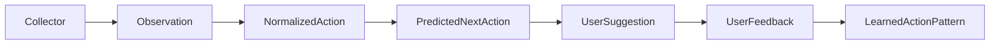

# Built-in Collector Spec

This spec defines the data contracts for collecting user activity, converting it
into stable actions, predicting the likely next action, and learning from user
feedback.

## Pipeline

Collectors capture raw state. Processors normalize that raw state into actions,
rank possible next actions, explain the best options in plain English, and learn
from the user's selection or dismissal.



## Responsibility Split

- **Collector** decides when to capture using anchors.
- **Observation** stores what was captured from macOS, browser, SeaTalk, or other sources.
- **NormalizedAction** converts noisy source data into stable user actions.
- **PredictionProcessor** ranks expected next actions using history and fuzzy similarity.
- **UserSuggestion** presents predicted actions in user-readable English.
- **UserFeedback** records whether the user selected, dismissed, corrected, or edited the suggestion.
- **LearnedActionPattern** boosts actions the user repeatedly accepts.

## Capture Triggers

Common anchors include:

- Every fixed interval, for example every 5 seconds.
- User clicked, typed, copied, pasted, or submitted something.
- Browser URL changed.
- SeaTalk message received.
- Active app or active window changed.
- File or clipboard content changed.
- Processor requested another snapshot.

## Shared Types

```ts
export type JsonValue =
  | string
  | number
  | boolean
  | null
  | JsonValue[]
  | { [key: string]: JsonValue };

export type ISODateTimeString = string;

// 0.0 to 1.0.
export type ConfidenceScore = number;

// Higher values make an action more likely to be suggested again.
export type PriorityScore = number;
```

## Collector Contract

Collectors emit observations into an event sink. They should not perform
prediction themselves.

```ts
export interface Collector {
  id: string;

  capabilities(): CollectorCapability[];

  start(
    config: CollectorConfig,
    sink: EventSink
  ): Promise<void>;

  stop(): Promise<void>;

  health(): CollectorHealth;
}

export interface EventSink {
  emit(observation: Observation): Promise<void>;

  emitBatch(
    observations: Observation[]
  ): Promise<void>;
}

export interface CollectorConfig {
  enabled: boolean;

  anchors?: AnchorConfig[];

  permissions?: string[];

  filters?: {
    includeApps?: string[];
    excludeApps?: string[];

    includeDomains?: string[];
    excludeDomains?: string[];
  };

  privacy?: {
    redactPII?: boolean;
    storeRaw?: boolean;
    retentionDays?: number;
  };
}

export interface CollectorCapability {
  name: string;
  description?: string;
}

export interface CollectorHealth {
  status: "healthy" | "degraded" | "unhealthy";

  message?: string;

  lastSuccessfulCollectionAt?: ISODateTimeString;
}
```

## Anchors

An anchor explains why a capture happened. For example, an anchor can represent a
mouse click, URL change, interval tick, app switch, or processor-requested
refresh.

```ts
export interface Anchor {
  id: string;

  type:
    | "time_interval"
    | "user_action"
    | "system_event"
    | "app_event"
    | "content_change"
    | "state_change"
    | "manual"
    | "processor_request";

  name: string;

  occurredAt: ISODateTimeString;

  target?: {
    app?: string;
    bundleId?: string;

    windowTitle?: string;

    url?: string;

    filePath?: string;

    elementRole?: string;
    elementTitle?: string;
  };

  metadata?: Record<string, JsonValue>;
}

export interface AnchorConfig {
  type: Anchor["type"];

  name?: string;

  enabled: boolean;

  intervalMs?: number;

  debounceMs?: number;

  throttleMs?: number;

  filters?: {
    apps?: string[];
    bundleIds?: string[];
    domains?: string[];
    eventNames?: string[];
  };
}
```

## Observation Model

An observation is a raw capture. It keeps source-specific data, privacy metadata,
and extraction quality so downstream processors can decide what to trust.

```ts
export interface Observation {
  id: string;

  collectorId: string;

  source: SourceInfo;

  time: TimeInfo;

  // WHY this observation was captured.
  anchor: Anchor;

  // WHAT was captured.
  subject: SubjectInfo;

  content: ContentInfo;

  context?: ContextInfo;

  artifacts?: ArtifactRef[];

  // Source-specific payload, for example AXTree or browser extension data.
  extraData?: Record<string, JsonValue>;

  privacy: PrivacyInfo;

  quality: QualityInfo;
}
```

### Observation Fields

```ts
export interface SourceInfo {
  type:
    | "macos"
    | "browser"
    | "chat"
    | "filesystem"
    | "email"
    | "calendar"
    | "clipboard"
    | "notification";

  app?: string;

  bundleId?: string;

  accountId?: string;

  workspaceId?: string;
}

export interface TimeInfo {
  observedAt: ISODateTimeString;

  eventTime?: ISODateTimeString;

  durationMs?: number;
}

export interface SubjectInfo {
  kind:
    | "window"
    | "tab"
    | "message"
    | "conversation"
    | "file"
    | "notification"
    | "clipboard"
    | "input"
    | "selection";

  title?: string;

  url?: string;

  filePath?: string;

  conversationId?: string;

  threadId?: string;
}

export interface ContentInfo {
  text?: string;

  markdown?: string;

  html?: string;

  metadata?: Record<string, JsonValue>;
}

export interface ContextInfo {
  activeApp?: string;

  activeWindowTitle?: string;

  userAction?:
    | "viewed"
    | "focused"
    | "typed"
    | "clicked"
    | "copied"
    | "pasted"
    | "sent"
    | "received"
    | "opened"
    | "closed"
    | "searched"
    | "submitted"
    | "selected"
    | "dismissed"
    | "edited";

  nearbyEvents?: string[];
}

export interface ArtifactRef {
  id: string;

  kind:
    | "image"
    | "video"
    | "audio"
    | "pdf"
    | "file"
    | "screenshot";

  uri: string;

  originalPath?: string;

  mimeType?: string;

  sizeBytes?: number;

  hash?: string;

  createdAt?: ISODateTimeString;

  modifiedAt?: ISODateTimeString;

  extracted?: {
    text?: string;

    thumbnailUri?: string;

    dimensions?: {
      width: number;
      height: number;
    };

    durationMs?: number;
  };

  access?: {
    mode: "reference" | "copy" | "temporary";

    permissionScope?: string[];
  };
}

export interface PrivacyInfo {
  sensitivity: "low" | "medium" | "high";

  containsPII?: boolean;

  redacted?: boolean;

  rawContentStored?: boolean;

  redactionStrategy?:
    | "none"
    | "mask"
    | "hash"
    | "drop"
    | "summarize";

  retentionDays?: number;

  allowedUses?: Array<
    | "collection"
    | "normalization"
    | "prediction"
    | "user_feedback_learning"
    | "debugging"
    | "training"
  >;

  permissionScope: string[];
}

export interface QualityInfo {
  confidence: ConfidenceScore;

  completeness: "partial" | "full";

  extractionMethod:
    | "api"
    | "accessibility"
    | "browser_extension"
    | "filesystem"
    | "ocr";
}
```

## Normalized Action Layer

Observations are raw and source-specific. Normalized actions are stable events
that fuzzy matching and prediction can compare across time.

```ts
export type ActionApp =
  | "seatalk"
  | "browser"
  | "macos"
  | "filesystem"
  | "other";

export type NormalizedActionType =
  | "view"
  | "focus"
  | "click"
  | "type"
  | "send_message"
  | "receive_message"
  | "open_url"
  | "search"
  | "copy"
  | "paste"
  | "select"
  | "submit"
  | "open_file"
  | "close"
  | "unknown";

export interface NormalizedAction {
  id: string;

  observationId: string;

  sequenceId?: string;

  app: ActionApp;

  source: SourceInfo;

  type: NormalizedActionType;

  target?: ActionTarget;

  input?: ActionInput;

  occurredAt: ISODateTimeString;

  confidence: ConfidenceScore;

  privacy: PrivacyInfo;

  quality?: QualityInfo;
}

export interface ActionTarget {
  app?: string;

  bundleId?: string;

  windowTitle?: string;

  url?: string;

  domain?: string;

  route?: string;

  conversationId?: string;

  threadId?: string;

  filePath?: string;

  elementRole?: string;

  elementTitle?: string;

  // Stable path from AXTree, DOM, or app-specific hierarchy.
  elementPath?: string;

  entityId?: string;

  metadata?: Record<string, JsonValue>;
}

export interface ActionInput {
  text?: string;

  redactedText?: string;

  textHash?: string;

  selectedText?: string;

  language?: string;

  metadata?: Record<string, JsonValue>;
}
```

## Action Sequences

A sequence groups recent normalized actions from a session. Prediction uses this
history to understand what the user is likely doing now.

```ts
export interface ActionSequence {
  id: string;

  userId?: string;

  sessionId?: string;

  startedAt: ISODateTimeString;

  updatedAt: ISODateTimeString;

  actions: NormalizedActionRef[];

  context?: {
    activeApp?: string;

    activeWindowTitle?: string;

    activeUrl?: string;

    metadata?: Record<string, JsonValue>;
  };
}

export interface NormalizedActionRef {
  actionId: string;

  occurredAt: ISODateTimeString;

  app: ActionApp;

  type: NormalizedActionType;

  targetSummary?: string;
}
```

## Prediction Layer

The prediction layer accepts recent observations or normalized actions, returns a
ranked candidate set, and records user feedback after suggestions are shown.

```ts
export interface PredictionProcessor {
  id: string;

  normalize(
    observation: Observation
  ): Promise<NormalizedAction[]>;

  predict(
    request: NextActionPredictionRequest
  ): Promise<PredictionSet>;

  createSuggestion(
    predictionSet: PredictionSet,
    options?: SuggestionOptions
  ): Promise<UserSuggestion>;

  recordFeedback(
    feedback: UserFeedback
  ): Promise<void>;
}

export interface NextActionPredictionRequest {
  id: string;

  sequenceId?: string;

  currentActionId?: string;

  observations?: Observation[];

  actions?: NormalizedAction[];

  maxCandidates?: number;

  locale?: string;

  createdAt: ISODateTimeString;

  privacy?: PrivacyInfo;
}

export interface PredictionSet {
  id: string;

  requestId: string;

  candidates: PredictedNextAction[];

  status: "ready" | "empty" | "low_confidence" | "error";

  errorMessage?: string;

  createdAt: ISODateTimeString;
}

export interface PredictedNextAction {
  id: string;

  requestId?: string;

  basedOnActionIds: string[];

  action: ExpectedAction;

  score: ConfidenceScore;

  priority: PriorityScore;

  reason?: string;

  evidence?: PredictionEvidence;

  model?: ModelInfo;

  expiresAt?: ISODateTimeString;

  createdAt: ISODateTimeString;
}

export interface ExpectedAction {
  app?: ActionApp;

  type: NormalizedActionType;

  target?: ActionTarget;

  input?: ActionInput;

  command?: {
    name: string;

    parameters?: Record<string, JsonValue>;
  };
}

export interface PredictionEvidence {
  fuzzySimilarity?: ConfidenceScore;

  historicalSelectionCount?: number;

  historicalDismissalCount?: number;

  recentFrequency?: number;

  matchedPatternIds?: string[];

  matchedActionIds?: string[];

  featureWeights?: Record<string, number>;
}

export interface ModelInfo {
  name: string;

  version?: string;

  provider?: string;
}
```

## User Suggestions

A suggestion is the user-facing form of a prediction set. The English text can be
generated by an AI model so the user can quickly understand the next action.

```ts
export interface SuggestionOptions {
  locale?: string;

  tone?: "concise" | "friendly" | "technical";

  maxChoices?: number;
}

export interface UserSuggestion {
  id: string;

  predictionSetId: string;

  predictions: PredictedNextAction[];

  // English text generated for the user, for example:
  // "Looks like you may want to send this message in SeaTalk."
  englishText: string;

  delivery?: {
    channel:
      | "desktop_notification"
      | "inline_overlay"
      | "chat_message"
      | "api";

    destination?: string;
  };

  status:
    | "created"
    | "shown"
    | "selected"
    | "dismissed"
    | "expired";

  createdAt: ISODateTimeString;

  shownAt?: ISODateTimeString;

  expiresAt?: ISODateTimeString;
}
```

## Feedback and Learning

Feedback updates future priority. Repeatedly selected actions should become more
likely to appear next time; repeatedly dismissed actions should be downgraded.

```ts
export interface UserFeedback {
  id: string;

  suggestionId: string;

  predictionId: string;

  feedback:
    | "selected"
    | "dismissed"
    | "wrong"
    | "edited";

  selectedActionId?: string;

  editedAction?: Partial<ExpectedAction>;

  priorityDelta?: number;

  occurredAt: ISODateTimeString;

  metadata?: Record<string, JsonValue>;
}

export interface LearnedActionPattern {
  id: string;

  signature: string;

  action: ExpectedAction;

  priority: PriorityScore;

  selectionCount: number;

  dismissalCount: number;

  lastSelectedAt?: ISODateTimeString;

  lastDismissedAt?: ISODateTimeString;

  sourcePredictionIds?: string[];

  metadata?: Record<string, JsonValue>;
}
```

## macOS AXTree Payload

The AXTree payload is optional source-specific data. It can be stored in
`Observation.extraData.axtree` when the macOS collector captures accessibility
state.

```ts
export interface AXTreeSnapshot {
  app: string;

  bundleId?: string;

  windowTitle?: string;

  selectedText?: string;

  visibleTexts: string[];

  focusedElement?: {
    role: string;

    title?: string;

    value?: string;

    path?: string;
  };

  tree?: AXNode;
}

export interface AXNode {
  id: string;

  role: string;

  subrole?: string;

  title?: string;

  value?: string;

  description?: string;

  enabled?: boolean;

  focused?: boolean;

  selected?: boolean;

  frame?: {
    x: number;
    y: number;
    width: number;
    height: number;
  };

  children?: AXNode[];
}
```
