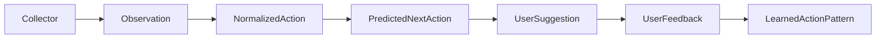

# Collector Spec Overview

This folder defines the interfaces for collecting user activity, passing it to
the engine, converting it into stable actions, predicting the likely next
action, and learning from user feedback.

## Pipeline



## Documents

- [Engine Collector Interface](./engine-collector-interface.md): the runtime
  contract between the engine and each collector.
- [Collected Data Interface](./collected-data-interface.md): the shape of the
  observations and artifacts collected from macOS, browser, SeaTalk, and other
  sources.
- [Prediction Interface](./prediction-interface.md): normalized actions,
  prediction requests, user-facing suggestions, and feedback learning.
- [macOS AXTree Payload](./axtree-payload.md): optional source-specific payload
  for macOS accessibility snapshots.

## Responsibility Split

- **Collector** decides when to capture using anchors.
- **Engine** starts and stops collectors, provides configuration, and receives
  observations through an event sink.
- **Observation** stores what was captured from macOS, browser, SeaTalk, or
  another source.
- **NormalizedAction** converts noisy source data into stable user actions.
- **PredictionProcessor** ranks expected next actions using history and fuzzy
  similarity.
- **UserSuggestion** presents predicted actions in user-readable English.
- **UserFeedback** records whether the user selected, dismissed, corrected, or
  edited the suggestion.
- **LearnedActionPattern** boosts actions the user repeatedly accepts.

## Shared Types

The following shared types are used across all documents in this folder.

```ts
export type JsonValue =
  | string
  | number
  | boolean
  | null
  | JsonValue[]
  | { [key: string]: JsonValue };

export type ISODateTimeString = string;

// 0.0 to 1.0.
export type ConfidenceScore = number;

// Higher values make an action more likely to be suggested again.
export type PriorityScore = number;
```
